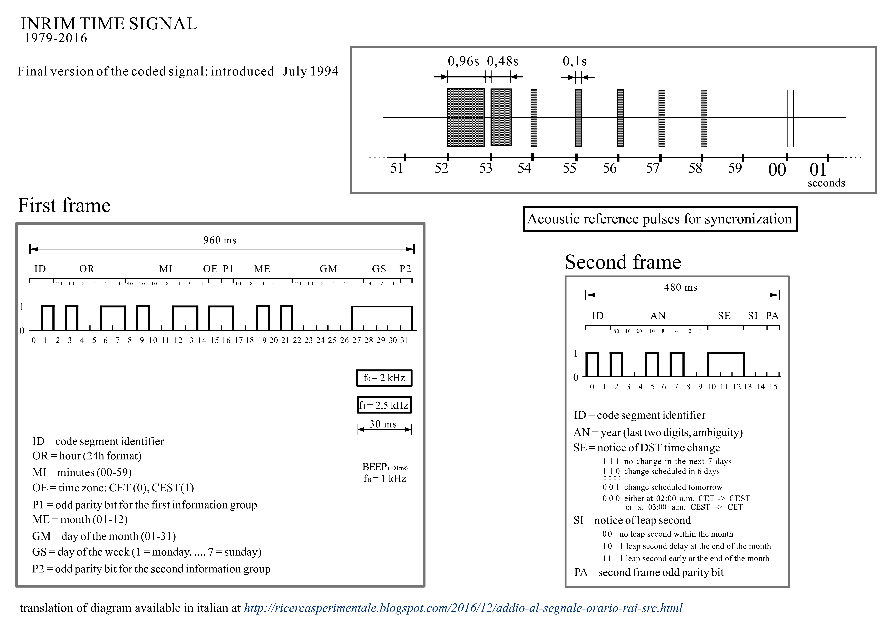

# pyRAIsrc - Time Signal Tools
Between 1979 and 2016, the italian national television and radio broadcast company (RAI) used to broadcast the exact time from the atomic clock of the INRiM, the national institute of metrologic research. After the 31st of December 2016, INRiM exact time stopped being broadcast by radio, in favour of the more efficient and precise Network Time Protocol syncronization. The time signal as of 2022 is still broadcast on Rai Radio 1 for nostalgia purposes, but isn't used to sync devices anymore.

What follows is a diagram explaining the structure of the coded time signal, translated from [Giorgio De Luca's personal blog](http://ricercasperimentale.blogspot.com/2016/12/addio-al-segnale-orario-rai-src.html). 

More information about the history of the SRC can be found on the [INRiM website](http://rime.inrim.it/labtf/src/)
